# LifeOnChip : Convay's game of life on silicon

An ASIC engine for a 16x16 array of convay's game of life.

This is a hobby project done just to learn the basics of macro-based RTL to GDS flow using OpenLane2. 

---

### Convay's Game of Life

Convay's game of life is a cellular automaton that consists of a 2D grid of cells, each of which could be in two states, alive or dead. In each timestep, each cell is updated based on the values of its neighbouring cells.

The states of the nearest 8 cells and the current state of a cell is used to determine the next state of the cell.


The number of live cells in the neighbourhood of a cell is used to decide its next state

| Number of live cells nearby | Next state |
|---    |---    |
| < 2   | Dead (underpopulation) |
| 2     | Old state |
| 3     | Alive (reproduction) |
| > 3   | Dead (overpopulation) |

Typically, the game of life is simulated on a computer where these rules are coded. However, these rules themself form a 

The project aims to simulate an array of convay's game of life on an ASIC using the Skywater130 process.

Play it here : [playgameoflife.com](https://playgameoflife.com/)

Learn about different structures and techniques in game of life here : [convaylife.com]([https](https://conwaylife.com/))

---

## Architecture

Each cell in GOL is a physical macro consisting of a state machine. 

The inputs are written like an SRAM array, with a word line.

To make the system scalable, the output each cell is read out like a shift register, vertically. The output registers in each cell are chained vertically to form a 16-bit shift register and the outputs are first loaded to the output register in each cell and shifted out. 

#### Cell structure

Each cell gets the states of the neighbouring cells and control signals like shift, load, run, etc as inputs.

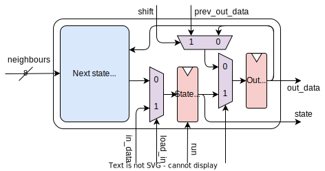

### Interconnections

Input signals are connected as shown below. Each bit of the ```in_load``` signal is shared between cells in the same row and ```in_data``` is split vertically. Each column gets a common ```in_data``` bit, similar to a memory array.

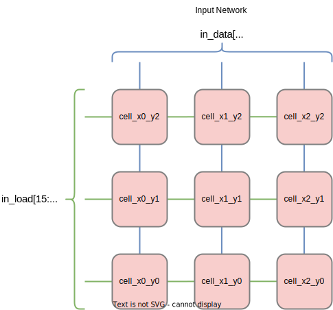

The states of neoghbouring cells are connected together as shown below. The boundary cells are tied to 0. The ```run``` signal is global

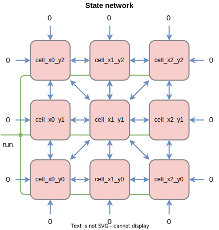

The outputs are connected like a shift register and shifted out. The ```out_load``` and ```out_shift``` signals are global

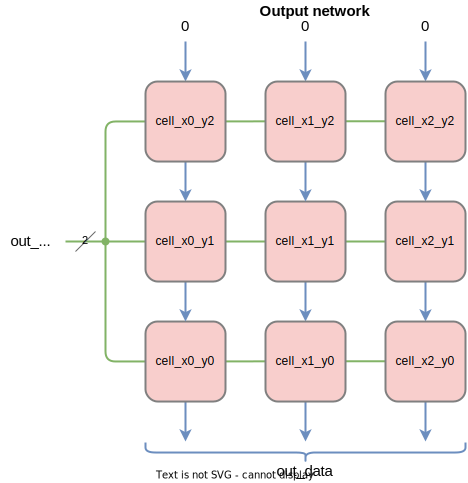

---

## Cell macro

The cell code is written in verilog in [```macros/life_cell/life_cell.v```](macros/life_cell/life_cell.v)

The IO placement is done manually in [```macros/life_cell/life_cell_io.cfg```](macros/life_cell/life_cell_io.cfg)

The final layout
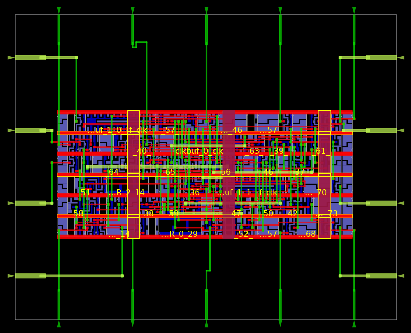

With only the Power Delivery Network (PDN) and clock tree. ```VPWR``` net is highlighted. The 
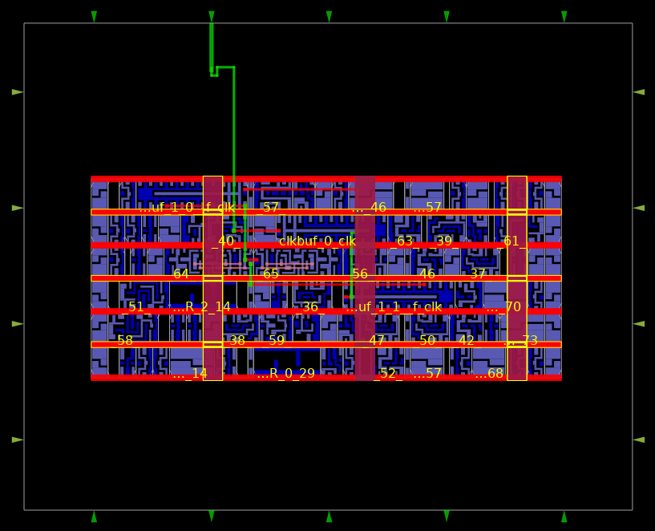

There is a significant amount of overhead for the IOs and the boundary. This makes the macro approach quite inefficient compared to normal flattened RTL design

---

## Toplevel layout

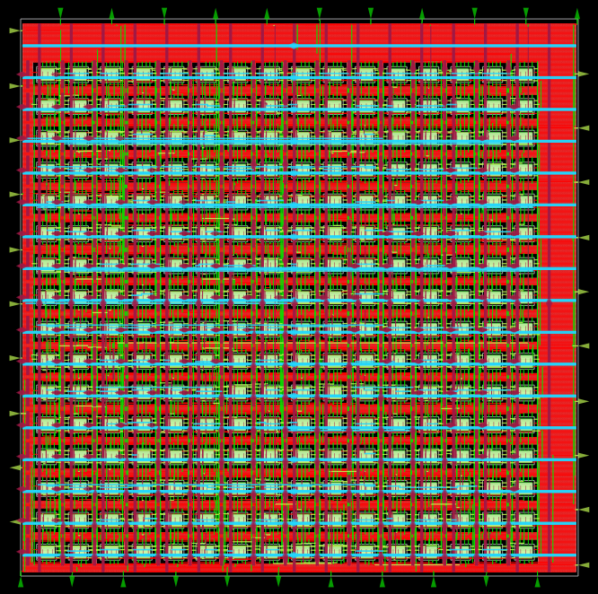
#### Macro placement

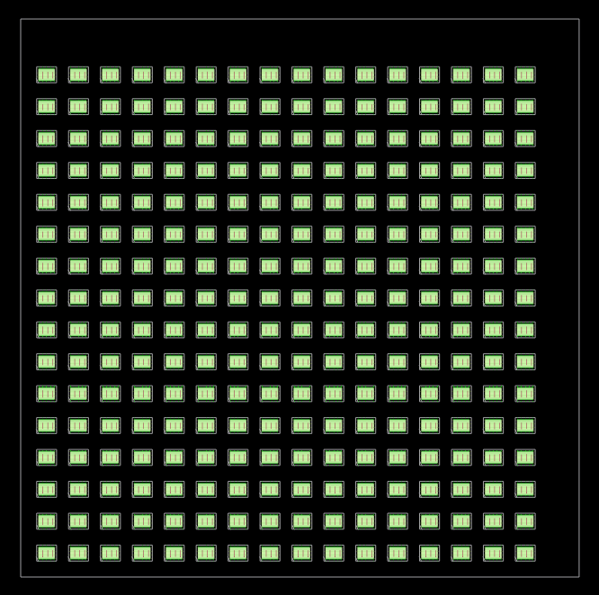

#### Global Power delivery network (PDN)

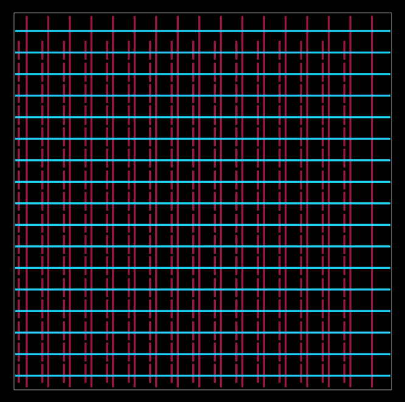

#### Clock tree

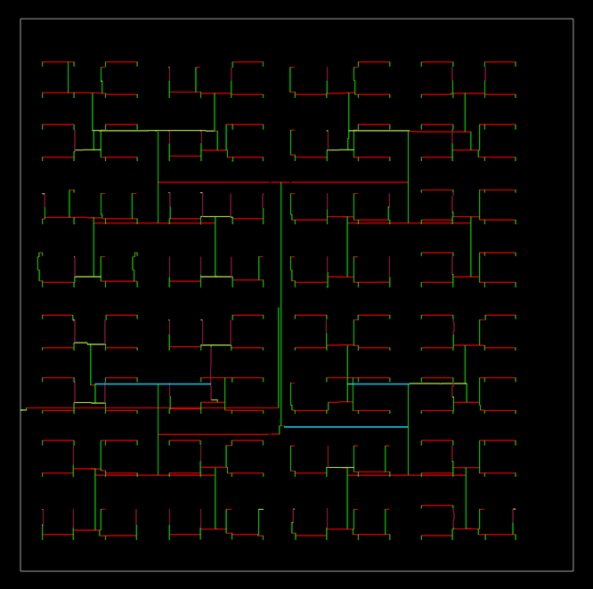

#### Signal routing

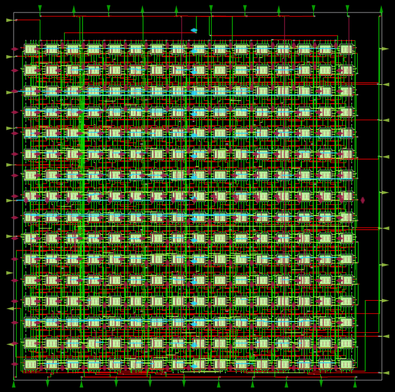

#### Array routing patterns

**Inputs**: Input load signal in glue and red, input data signals in green
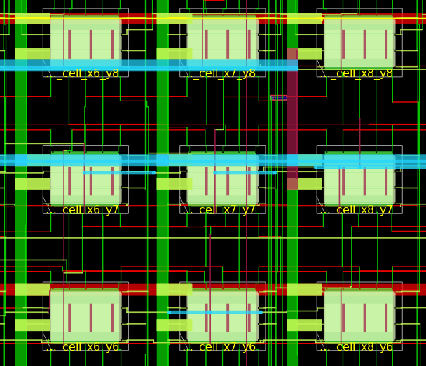

**States**: From centre block to neighbours
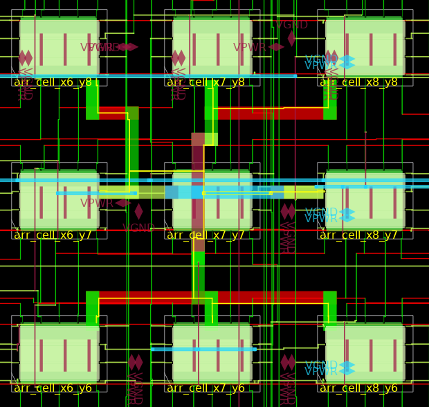

**Outputs**: Output data signals cascaded as a shift register
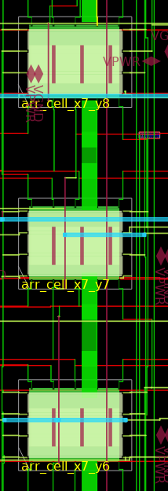

